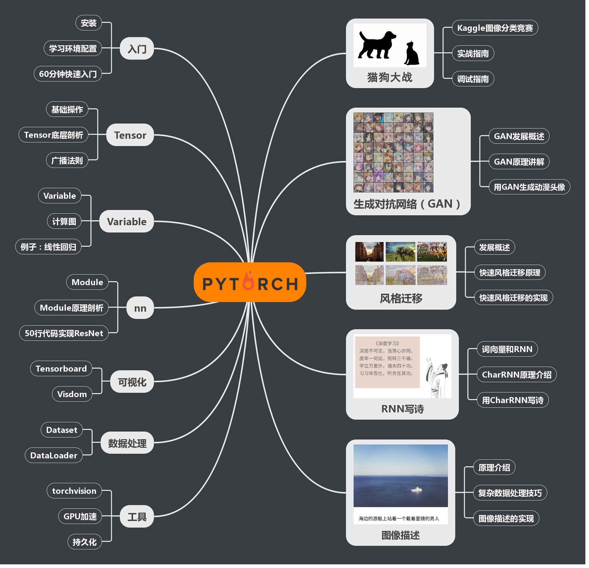

这是陈云老师所著书籍《深度学习框架PyTorch：入门与实践》的对应代码，但是也可以作为一个独立的PyTorch入门指南和教程。
我（lawson）对其做了一些注释和修改，用于理解和使用深度学习。
>陈云老师的原仓库链接：https://github.com/chenyuntc/pytorch-book

## 更新说明
Working on migration to Pytorch 1.0, stay tuned!

当前版本的代码是基于pytorch 1.0.1， 如果想使用旧版的 请 `git checkout v0.4` 或者 `git checkout v0.3`。旧版代码有更好的python2/python3 兼容，CPU/GPU兼容测试。 新版的代码未经过完整测试，已在GPU和python3 下测试通过。但是理论上在python2和CPU上不应该有太多的问题。

## 内容

该书（教程/仓库）的内容如图所示：


可以看出本教程可以分为两部分：

**基础部分**（前五章）讲解PyTorch内容，这部份介绍了PyTorch中主要的的模块，和深度学习中常用的一些工具。对于这部分内容，这里利用Jupyter Notebook作为教学工具，读者可以结合notebook修改运行，反复实验。

- 第二章介绍如何安装PyTorch和配置学习环境。同时提供了一个快速入门教程，基于官方的教程简化并更新内容，读者可以花费大约1到2小时的时间快速完成入门任务，而后根据需求再选择深入阅读后续相关章节的内容。
- 第三章介绍了PyTorch中多维数组Tensor和动态图autograd/Variable的使用，并配以例子，让读者分别使用Tensor和autograd实现线性回归，比较二者的不同点。除了介绍这二者的基础使用之外，本章还对Tensor的底层设计，以及autograd的计算图原理进行比较深入分析，希望能使得读者能对这些底层知识有更全面的掌握。
- 第四章介绍了PyTorch中神经网络模块nn的基础用法，同时讲解了神经网络中“层”，“损失函数”，“优化器”等，最后带领读者用不到50行的代码搭建出曾夺得ImageNet冠军的ResNet。
- 第五章介绍了PyTorch中数据加载，GPU加速，持久化和可视化等相关工具。

**实战部分**（第六到十章）利用PyTorch实现了几个酷炫有趣的应用，对于这部分的内容，本仓库给出完整的实现代码，并提供预训练好的模型作为demo，供读者测试。

- 第六章是承上启下的一章，这一章的目标不是教会读者新函数，新知识，而是结合Kaggle中一个经典的比赛，实现一个深度学习中比较简单的图像二分类问题。在实现过程中，带领读者复习前五章的知识，并提出代码规范以合理的组织程序，代码，使得程序更加可读，可维护。第六章还介绍了在PyTorch中如何进行debug。
- 第七章为读者讲解了当前最火爆的生成对抗网络（GAN），带领读者从头实现一个动漫头像生成器，能够利用GAN生成风格多变的动漫头像。
- 第八章为读者讲解了风格迁移的相关知识，并带领读者实现风格迁移网络，将自己的照片变成高大上的名画。
- 第九章为读者讲解了一些自然语言处理的基础知识，并讲解了CharRNN的原理。而后利用收集了几万首唐诗，训练出了一个可以自动写诗歌的小程序。这个小程序可以控制生成诗歌的**格式**，**意境**，还能生成**藏头诗**。
- 第十章为读者介绍了图像描述任务，并以最新的AI Challenger比赛的数据为例，带领读者实现了一个可以进行简单图像描述的的小程序。
- 第十一章（**新增，实验性**） 由[Diamondfan](https://github.com/Diamondfan) 编写的语音识别。完善了本项目（本项目已囊括图像，文本，语音三大领域的例子）。


 **Notebook中的文字描述内容属于本书的初稿，有描述不通顺，错别字之处还请谅解**。本打算删除notebook中描述的内容，只留下代码，但为了方便读者阅读学习，最终还是决定留下。 我会抽空根据书中内容逐字校对这部分内容，但并不对此并不提供具体时间点。

## 代码说明

- 代码主要在python3下测试得到最终结果，python2暂未测试。v0.2和v0.3 分支的代码同时经过严格测试支持python2/python3
- 实战部分代码同时在GPU和CPU环境下测试通过
- 代码已更新兼容到PyTorch `0.4.1`, 后续会考虑兼容 `v1.0`，但暂无确切时间点。

如果你想在PyTorch 0.2.0或0.3下运行,请 
```
git checkout v0.2 # v0.3
```

如果有任何不当，或者有待改进的地方，欢迎读者开issue讨论，或者提交pull request。

## 环境配置

1. 安装[PyTorch](http://pytorch.org)，请从官网选择指定的版本安装即可，一键安装（即使你使用anaconda，也建议使用pip）。更多的安装方式请参阅书中说明。

2. 克隆仓库

   ```python
   git clone https://github.com/chenyuntc/PyTorch-book.git
   ```

3. 安装第三方依赖包

   ```python
   cd pytorch-book && pip install -r requirements.txt
   ```
